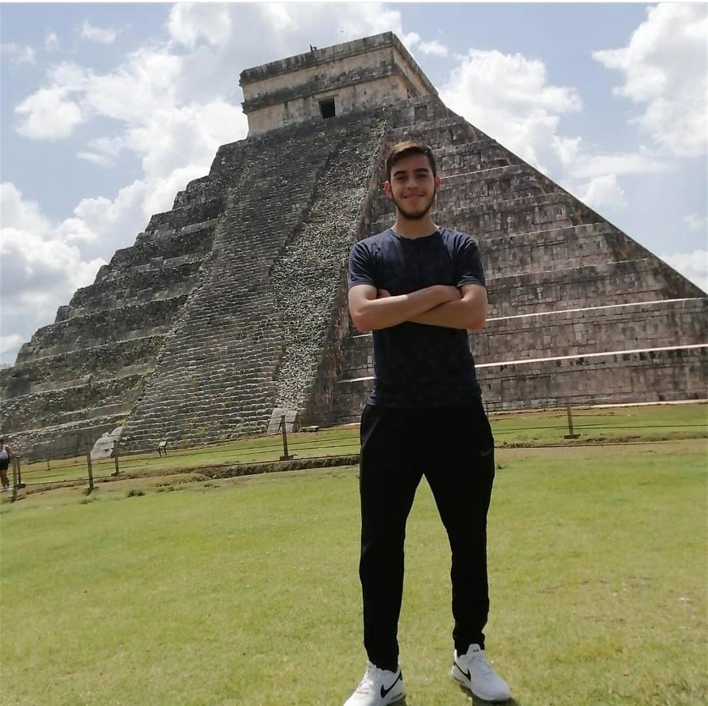

# Escuela colombian de ingeniería Julio Garavito

##  Francisco Márquez

*carnet*: 2157517

**francisco.marquez@mail.escuelaing.edu.co**

Mis hobbies son:
* jugar voleibol
* jugar ajedrez
* practicar boxeo



![] (https://medac.es/sites/default/files/blog/destacadas/entrenamiento-voleibol.jpg)

Mi perfil en el campus virual es  [Moodle][1] 

[1]:https://campusvirtual.escuelaing.edu.co/moodle/user/profile.php?id=18320

Soy estudiante de la escuela colombiana de ingenieria Juio Garavito, nai en bogota y tengo 2 hermanos actualmente estoy viendo las siguientes materias:

1. PRYE
2. AUPN
3. CVDS
4. ACSO


Este es el código de una multiplicacion en java:
```
float a;
float b;
float c;

a = 4.3;
b = 7.1

c = a * b;
System.out.println(c);
```

