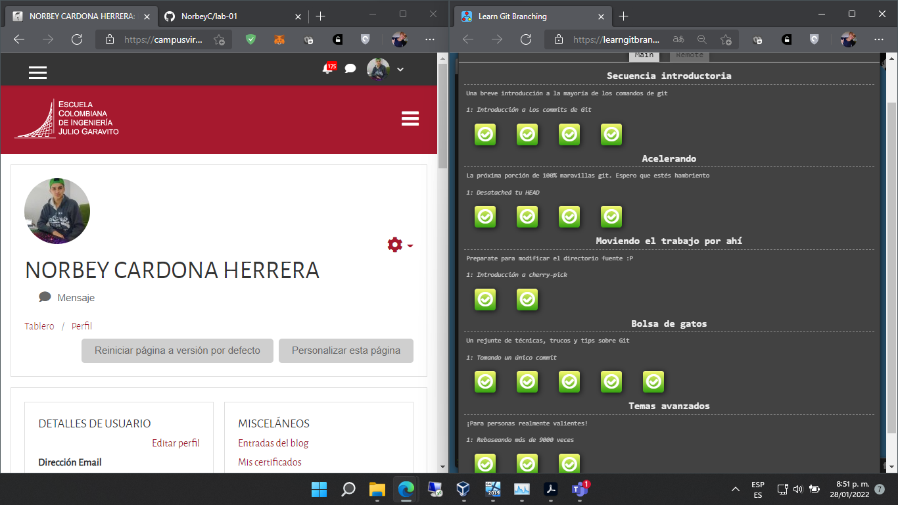
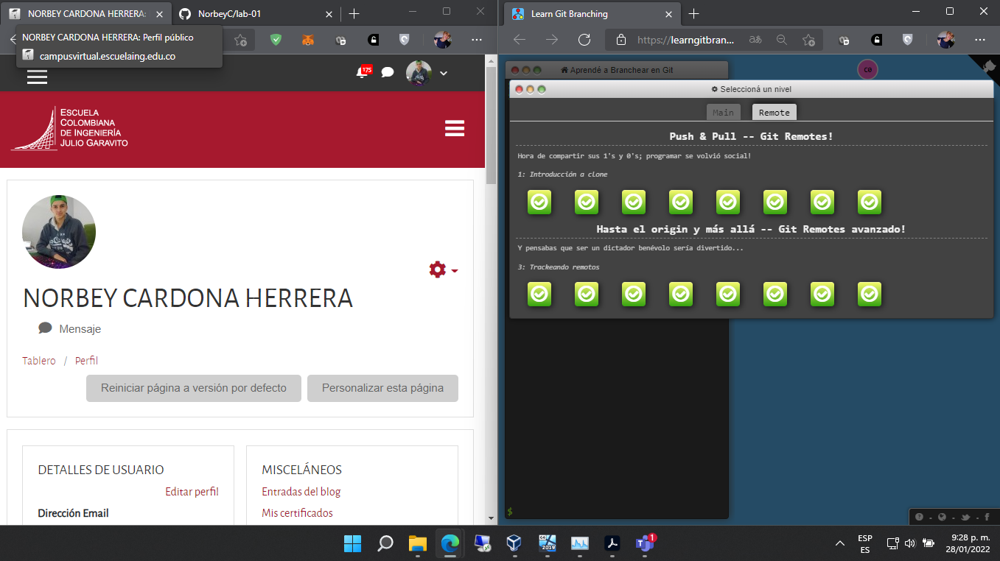

# Norbey Cardona

## Escuela colombian de ingeniería Julio Garavito

*estudiante*

**norbey.cardona@mail.escuelaing.edu.co**

Algunos animales que me gustan son:
* caballo
* gato
* perro


Este es mi [instagram][1] 

[1]:https://www.instagram.com/norbey_ch/?utm_medium=copy_link

Soy de Pensilvania Caldas, estoy en octavo semestre y estoy cursando las siguientes materias:

1. RECO
2. AUPN
3. CVDS
4. EGI3
5. TPRO

Este es el código de una suma en java:
```
int a;
int b;
int c;

a = 4;
b = 7;

c = a + b;
System.out.println(c);
```

## Parte 3




